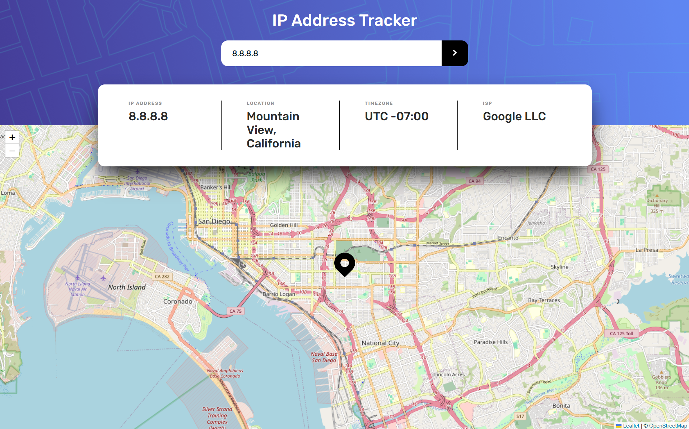
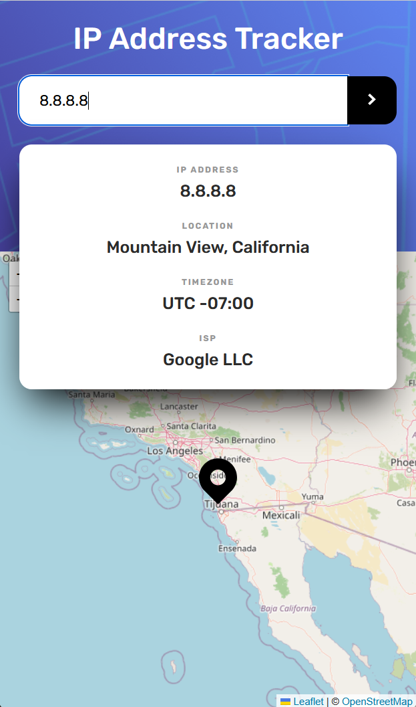
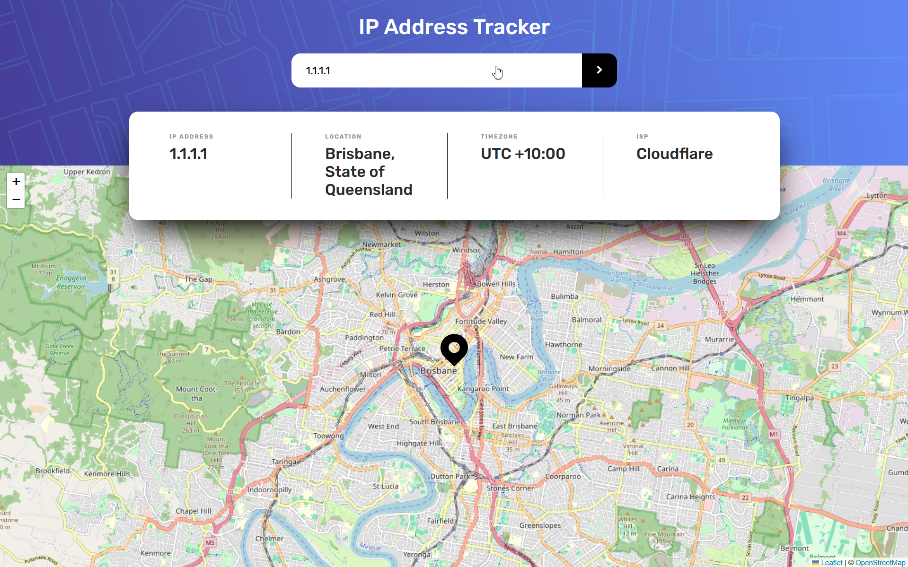
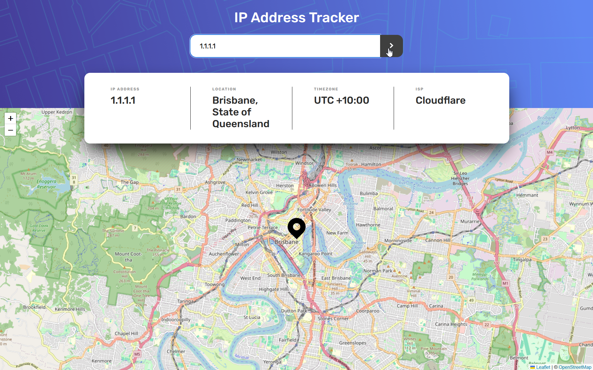

# Frontend Mentor - IP address tracker solution

This is a solution to the [IP address tracker challenge on Frontend Mentor](https://www.frontendmentor.io/challenges/ip-address-tracker-I8-0yYAH0).

## Table of contents

- [Overview](#overview)
    - [The challenge](#the-challenge)
    - [Screenshot](#screenshot)
    - [Links](#links)
- [My process](#my-process)
    - [Built with](#built-with)
    - [What I learned](#what-i-learned)
    - [Useful resources](#useful-resources)
    - [AI Collaboration](#ai-collaboration)
- [Author](#author)

## Overview

### The challenge

Users should be able to:

- View the optimal layout for each page depending on their device's screen size
- See hover states for all interactive elements on the page
- See their own IP address on the map on the initial page load
- Search for any IP addresses or domains and see the key information and location

### Screenshots






### Links

- Solution URL: [Add solution URL here](https://your-solution-url.com)
- Live Site URL: [Add live site URL here](https://your-live-site-url.com)

## My process

### Built with

- Semantic HTML5 markup
- CSS custom properties
- Flexbox
- CSS Grid
- Mobile-first workflow
- Vanilla JavaScript (ES6 Modules) – Organized using modules (api, ui, map, app)
- Leaflet.js – Mobile-friendly interactive maps
- IPify Geolocation API – Real-time IP and Domain tracking

### What I learned

This project was a deep dive into Asynchronous JavaScript and Modular Design Patterns. I learned how to move away from "spaghetti code" by treating different parts of the application as different assistants of a main program.

One of my major takeaways was the Singleton Pattern (a design pattern that ensures a class or an object has only one instance throughout the entire life of the application) for third-party libraries. To prevent the map from re-initializing and crashing the browser, I implemented a check to see if the map instance already existed:

```js
if (!map) {
    map = L.map("map").setView([lat, lng], 13);

    L.tileLayer("https://tile.openstreetmap.org/{z}/{x}/{y}.png", {
        maxZoom: 19,
        attribution: '&copy; <a href="http://www.openstreetmap.org/copyright">OpenStreetMap</a>',
    }).addTo(map);
}
```

### Useful resources

- [Leaflet.js Documentation](https://leafletjs.com/reference.html) - This was essential for understanding the L.icon and setLatLng methods.
- [MDN Web Docs: Fetch API](https://developer.mozilla.org/en-US/docs/Web/API/Fetch_API/Using_Fetch) - This helped me refine my defensive programming with response.ok.

**Note: Delete this note and replace the list above with resources that helped you during the challenge. These could come in handy for anyone viewing your solution or for yourself when you look back on this project in the future.**

### AI Collaboration

I collaborated with Gemini as a skeptical mentor to build this project.

- The Process: Instead of asking for direct code, I worked through architectural plans, discussing the trade-offs between procedural and modular code.

- What worked well: The AI acted as a "Research Partner", helping me troubleshoot the CSS "Mobile-First" struggle, and gave me hints and clues for me to figure out and implement to my code.

- Key Outcome: This collaboration ensured that the final solution was functional while helping me learn by coding.

## Author

- GitHub - [Cankutay3104](https://github.com/Cankutay3104)
- Frontend Mentor - [@Cankutay3104](https://www.frontendmentor.io/profile/Cankutay3104)
